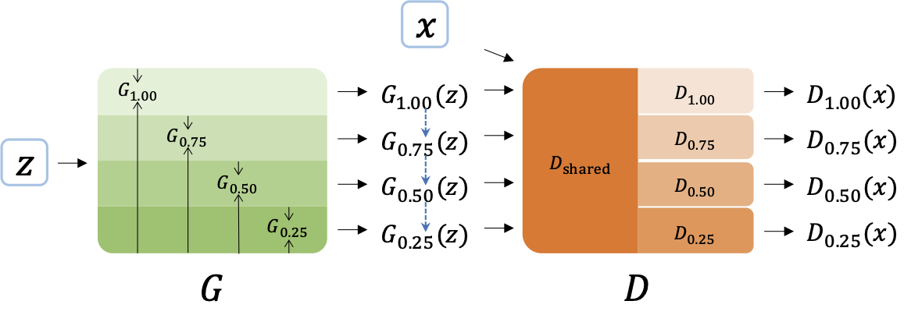

## Slimmable Generative Adversarial Networks

This is a PyTorch implementation of [Slimmable Generative Adversarial Networks](https://arxiv.org/abs/2012.05660).



### Requirements

The code has been tested running under Python 3.6.8, with the following packages installed (along with their dependencies):

```shell
pip install -r requirements.txt
```


### Usage

First, please enter the `examples` directory .


To run the individual GANs, we give the following example script.

- SNDCGAN on CIFAR-10 with 1.0x width.

```shell
python baseline.py --dataset cifar10 --arch dcgan --width_mult_g 1.00 --width_mult_d 1.00 --setting C --n_steps 100000 --loss hinge --log_dir ./logs/gan_cifar10_dcgan_wg100_wd100
```


To run the SlimGAN, we give the following example scripts.

- SNResGAN (ResNet) based SlimGAN on CIFAR-10

```shell
python main.py --dataset cifar10 --arch resnet --setting G --alpha 20 --stepwise --n_share 2 --log_dir ./logs/slimgan_cifar10_resnet_alpha20_stepwise_nshare2
```

- cGANpd based SlimGAN on CIFAR-10

```shell
python main.py --dataset cifar10 --arch resnet --setting G --cond --alpha 10 --stepwise --n_share 2 --log_dir ./logs/slimgan_cifar10_cganpd_alpha10_stepwise_nshare2
```


### Acknowledgments

This repository is developed based on [Mimicry](https://github.com/kwotsin/mimicry) and [slimmable_networks](https://github.com/houliangict/slimmable_networks).